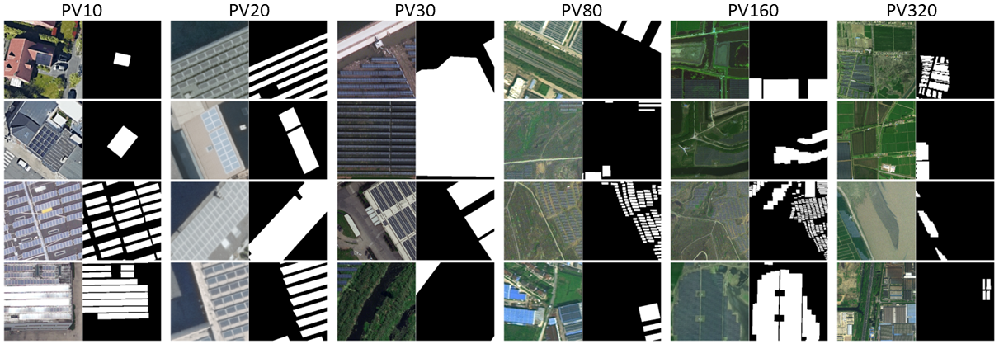
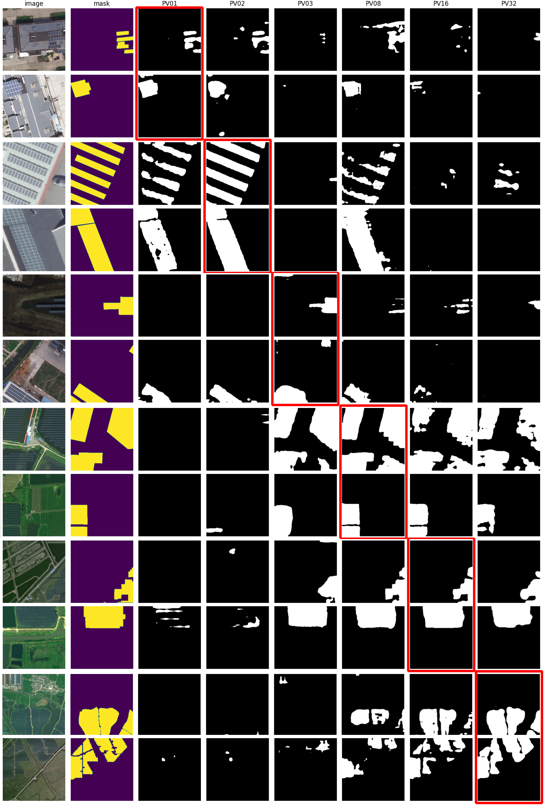
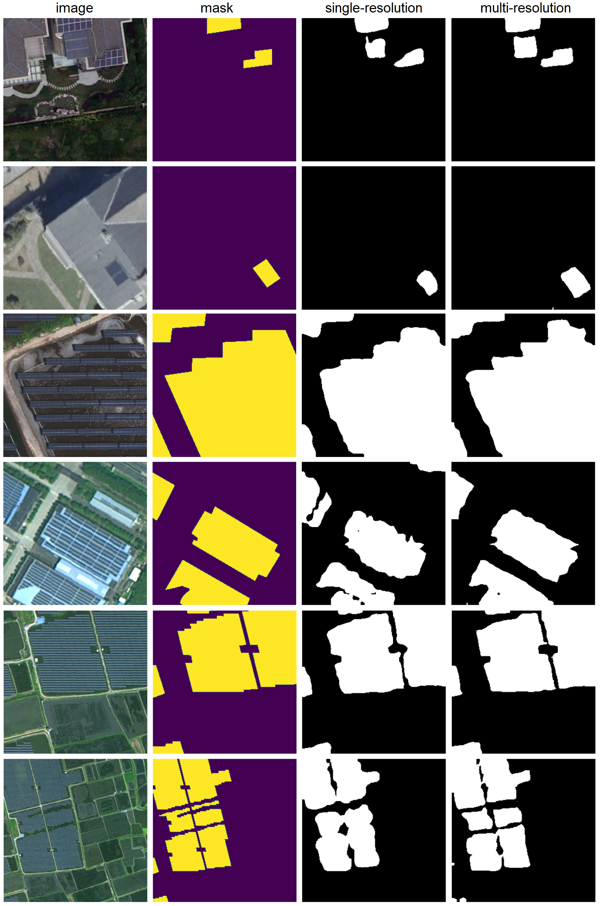

# Multi-Resolution Segmentation of Solar Photovoltaic Systems Using Deep Learning

Repository for a machine learning and remote sensing based framework for segmenting solar photovoltaic systems at different image resolutions. 

## Abstract
In the realm of solar photovoltaic system image segmentation, existing deep learning networks focus almost exclusively on single image sources both in terms of sensors used and image resolution. This often prevents the wide deployment of such networks. Our research introduces
a novel approach to train a network on a diverse range of image data, spanning UAV, aerial, and satellite imagery at both native and aggregated resolutions of 0.1 m, 0.2 m, 0.3 m, 0.8 m, 1.6 m, and 3.2 m. Using extensive hyperparameter tuning, we first determined the best possible parameter combinations for the network based on the DeepLabV3 ResNet101 architecture. We then trained a model using the wide range of different image sources. The final network offers several advantages. It outperforms networks trained with single image sources in multiple test applications as measured by the F1-Score (95.27%) and IoU (91.04%). The network is also able to work with a variety of target imagery due to the fact that a diverse range of image data was used to train it. The model is made freely available for further applications.

## Materials
In the work the datasets of 3 different publications are combined. The first dataset mentioned here is aerial imagery from the Federal Agency for Cartography and Geodesy (BKG) in Germany in the state of North Rhine-Westphalia with a native resolution of 10 cm [[Mayer et al. 2020](https://github.com/kdmayer/PV_Pipeline)]. Other datasets used were imagery data within China obtained from unmanned aerial vehicles (UAV) in Hai'an country, area imagery from the Provincial Geomatics Center (PGC) of Jiangsu, and satellite imagery from Gaofen-2 and Beijing-2with resolutions of 10 cm, 30 cm, and 80 cm, respectively, with masks of existing PV plants [[Jiang et al. 2021](https://zenodo.org/record/5171712)]. The recently published dataset [[Kasmi et al. 2023](https://github.com/gabrielkasmi/bdappv)] combines overflight imagery in France from the Geoservices portal of the National Institute of Geographic and Forest Information (IGN) with a native resolution of 20 cm on the one hand and imagery acquired with GEE with 10 cm native resolution around different locations in Germany on the other hand. Subsequently, the datasets were combined to 6 different resolution variants. An exemplary representation is shown in the following figure. 

  

Illustration of the different training images, with each their of corresponding resolution level labeled at the top. The images with PV systems are shown on the left and the masks for training are shown on the right, with the PV systems highlighted in white. Details on the preparation are explained in the publication. 

## Models trained with single-resolution images

  

Illustration of the different predictions, where each exemplary image is labeled according to resolution levels. The images are sorted in ascending order of resolution. The horizontal label refers from left to right to the underlying image and the mask, next to the dataset used for training the respective models. The red box indicates where the resolution of the training and the test application are the same.

## Model trained with multi-resolution images

  

Comparison of the single-resolution trained networks versus the final multi-resolution trained network. From left to right, first are the images and masks, next are the predictions of the single-resolution networks suitable for each image. The predictions of the multi-resolution network are shown on the right.

## Model
The model is a DeepLabV3 ResNet101 variant with approximately 61 million model parameters and 258.7 GFLOPS. Trained using Python 3.10, Torch 1.14.0, and Torchvision 0.15.0, the final model configurations are summarized below. BCE loss was used as the loss function, Adam as the optimizer, 0.0001 as the learning rate, a batch size of 8, 100 epochs, and a stride of 2. The ASSP segmentation head was set to 2048 input channels and 12, 24, and 36 dilation rates. 

The final model's weights are published on Zenodo, after downloading it can simply be placed in the 'weights' folder. 

## Data
The repository does not contain any training data. However, these can be downloaded from the respective authors.  
[[Mayer et al. 2020](https://github.com/kdmayer/PV_Pipeline)]
[[Jiang et al. 2021](https://zenodo.org/record/5171712)]
[[Kasmi et al. 2023](https://github.com/gabrielkasmi/bdappv)]  

## Usage
An demonstration of the network's application is executable on [[Google Colab]](https://colab.research.google.com/drive/1UZmu83Os8tVaLIiGjlXRbJ_zexIJK5uX?usp=sharing). Examples of hyperparameter tuning, training, validation and prediction can be found in 'scripts'. 

## Funding
This work is developed in the OASES Project - "Development and Demonstration of a Sustainable Open Access AU-EU Ecosystem for Energy System Modelling". The project is part of the LEAP-RE Program. LEAP-RE has received funding from the European Union ’s Horizon 2020 Research and Innovation Program under Grant Agreement 963530. The Research is funded by Bundesministerium für Bildung und Forschung (03SF067) to University of Kassel, Research funding providing by South African National Energy Development Institute (SANEDI) and Department of Science and Innovation (DSI) to CSIR for LEAP-RE OASES project.